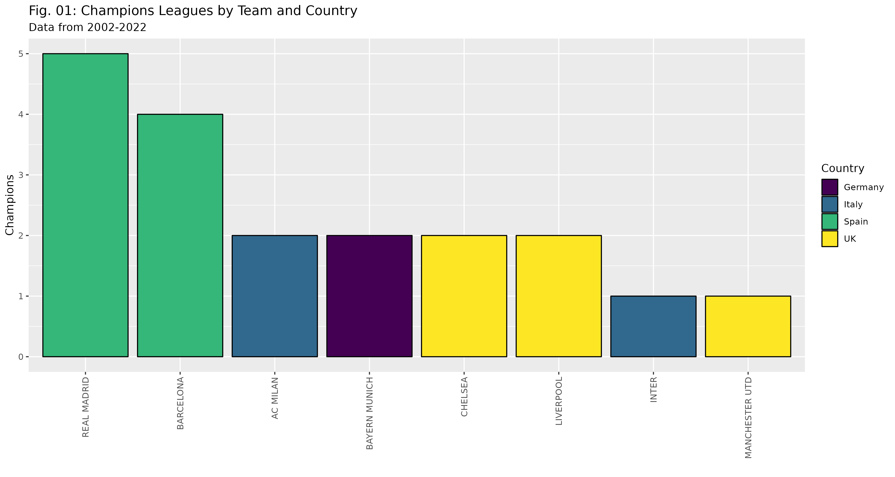
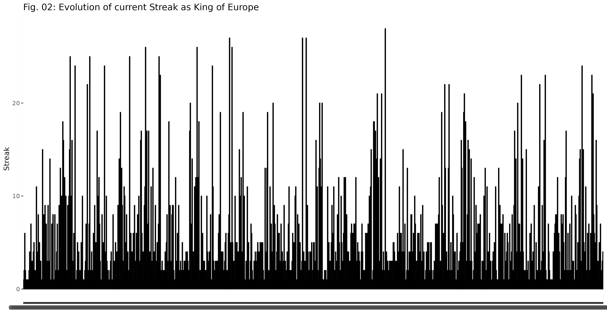
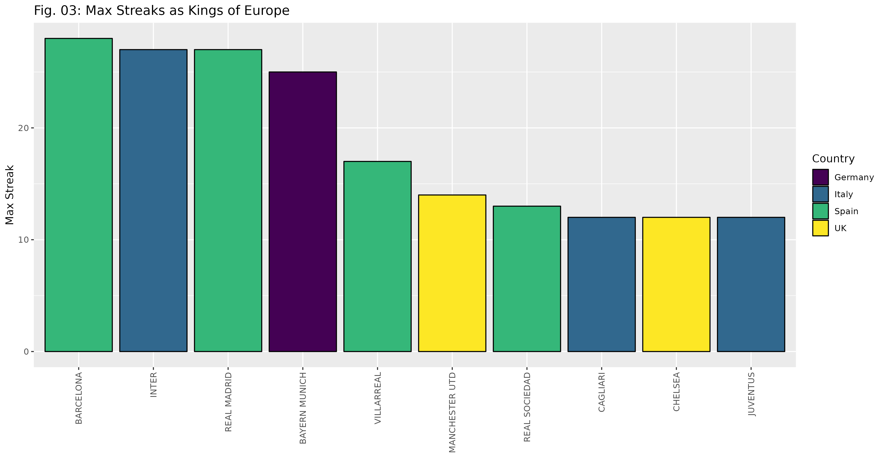
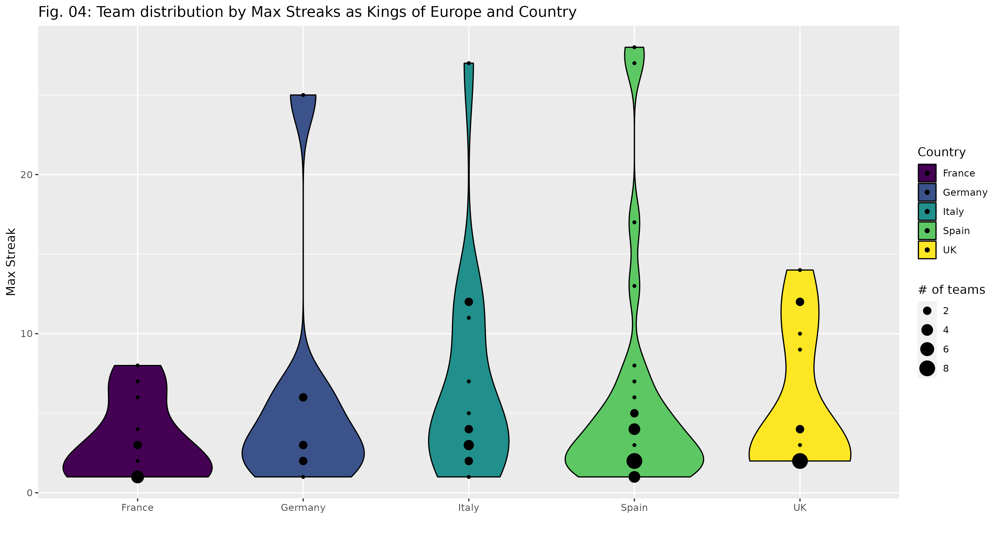
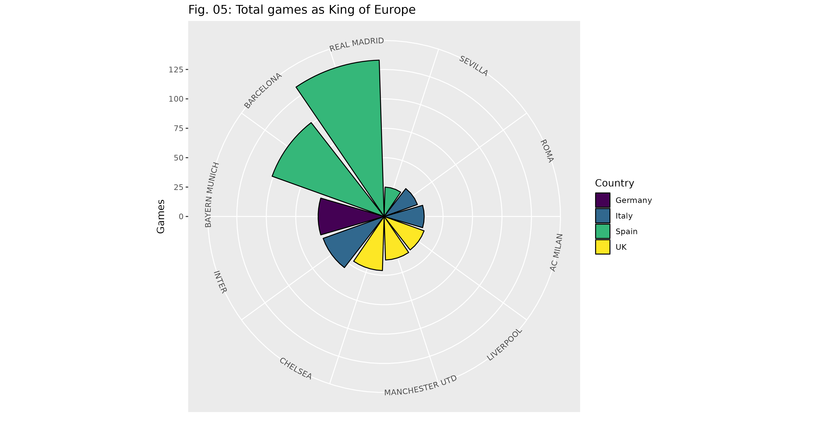
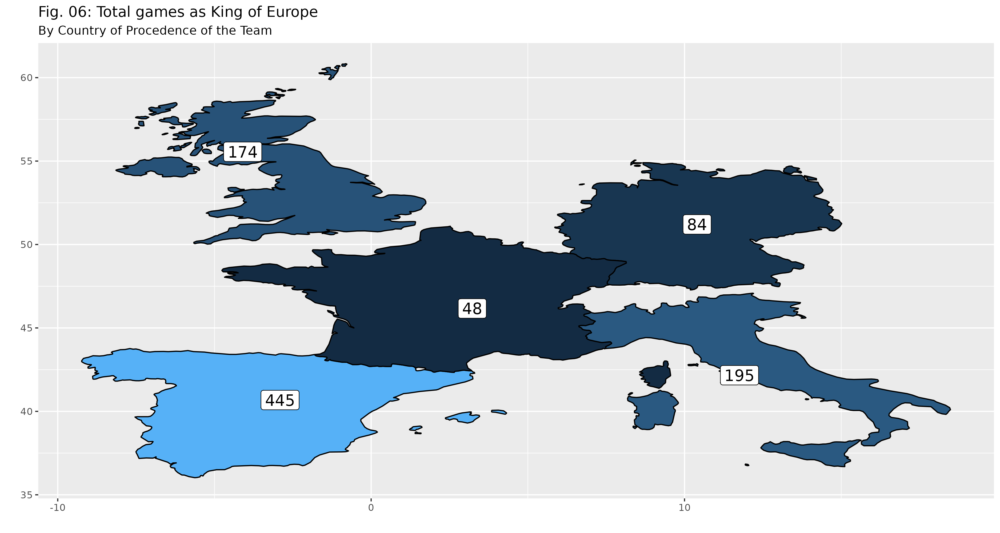

# Objetive
After elaborating the first analysis, I would like to improve it, adding new metrics based on functions and adding new visualizations such as maps for practice.

Let's remember the rules: We start in the year 2022, the current champion is Real Madrid after winning the 2001-2002 Champions League Title. From then on and, in every league or cup match, the crown is played. Every time someone manages to defeat him, he conquers the crown and takes it until he is beaten or it reigns a new champion (annually in the final of the Cahmpions League)

# Data source
All data is uploaded in a Kaggle repository (https://www.kaggle.com/datasets/willfitzhugh/european-soccer-data) Data from 2002 to Oct/2022

# Programs and packages
All analysis in R, main packages: tidyverse, dplyr, tidyr, ggplot2, lubridate, forcats and viridis

# Processes
1. Data cleaning (nulls and format changes)
2. Creation of champion column with self-referential conditional
3. Creation of new champion column if conditions are met
4. Creation of streak column if new champion stays the same
5. Calculation of the country by most matches of each team and graphs per country
6. Creation of charts by teams and countries

# Analysis results

## Champions League Winners
 

## Streaks Evolution

## Top 10 Streaks per Team and grouped by Country
 

## Total games as King of Europe by Country and Map representation
 

# Lessons learned and recommendations
1. Creation of self-referenced column with streaks counter
2. Map representation

# Limitations and what can be improved
The amount of data is optimal. There are no limitations other than trying to present as much data as possible with as few graphs as possible to condense the information.
